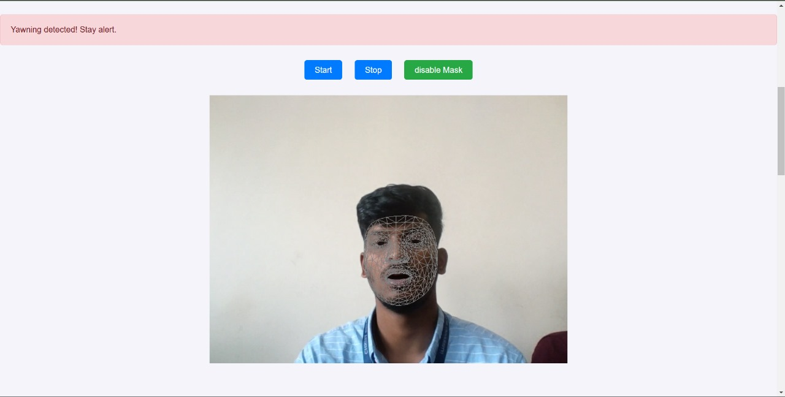

# Drowsiness and Yawning Detection System

This project detects drowsiness and yawning in real-time using webcam feeds. It employs facial landmark analysis for monitoring and provides real-time text and voice alerts to ensure safety and productivity.

## Features
- **Real-time Detection**: Monitors facial landmarks for drowsiness and yawning detection.
- **Alerts**: Generates both text and audio alerts for timely notifications.
- **Customizable Thresholds**: Easily configurable detection parameters for different use cases.
- **Web Interface**: A user-friendly web application for controlling and viewing detections.

---

## Installation Guide

Follow the steps below to set up the project on your local machine:

### Step 1: Clone the Repository
Clone this repository to your local machine:
```bash
git clone https://github.com/kushalsourav/CV_hackathon.git
```
Navigate into the project directory:
```bash
cd CV_hackathon
```
### Step 2: Create a Python Virtual Environment

To avoid conflicts with other Python packages, create a virtual environment inside the project folder:

```bash
python -m venv env
```
### Step 3: Activate the Virtual Environment
Activate the virtual environment depending on your operating system:

#### Windows:
```bash
env\Scripts\activate
```
#### MAcOs:
```bash
source env/bin/activate
```

### Step 4: Install Project Dependencies
Install the required dependencies listed in the `requirements.txt` file:

```bash
pip install -r requirements.txt
```

### Step 5: Run the Application
Start the Flask application by running the `app.py` file:

```bash
python app.py
```


### Step 6: Access the Web Interface
Once the Flask application is running, open your web browser and navigate to the following URL:

```bash
http://127.0.0.1:5000/
```



